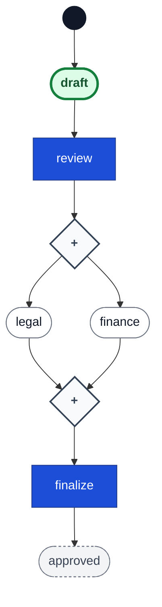

# Go Workflow

[](https://github.com/ehabterra/workflow/actions/workflows/ci.yml)
[](https://pkg.go.dev/github.com/ehabterra/workflow)
[](https://go.dev/)
[](https://github.com/ehabterra/workflow/blob/main/LICENSE)
[](https://codecov.io/gh/ehabterra/workflow)

An **embedded, declarative, Petri-net workflow library** for Go — the
Symfony Workflow of Go, not a Temporal competitor. Your process is data
(places, transitions, guards — in YAML or Go), your state is a persisted
**marking**, and every state change is an atomic, optimistically-concurrent
save. Parallel branches, synchronizing joins, per-entity tokens with data,
host-driven timers, audit trails, and always-accurate diagrams are all
first-class — with the library staying a library: it never runs a scheduler,
never replays your code, and never acts on its own.

Inspired by the [Symfony Workflow Component](https://symfony.com/doc/current/workflow.html).

> **Status:** beta, pre-1.0. The core loop (load → fire → save atomically)
> has been hardened against a production-shaped reference system and every
> claim in this README is backed by shipped, tested behavior — but APIs may
> still change before v1.0 (breaking changes are documented in the
> [CHANGELOG](CHANGELOG.md)).

## Is this the right tool?

**Reach for it when** your entities have real *process*: several things
legitimately in flight at once (legal *and* finance review), joins that must
wait for all branches, guarded routing over business data, deadlines that
survive restarts, an audit trail that must never disagree with the state —
the moment you catch yourself adding a boolean flag next to a `status`
column, you have found a second place.

**Skip it when** a single status column with a flat action→status table is
truly all your domain needs — a Petri net is oversized for a linear state
machine, and honest about it. And if you want durable *execution* (resumable
functions, replayed histories, automatic retries), you want Temporal-style
tooling: here state is persisted, **code is not**. The full list of things
this library deliberately does not do — each with the host-side pattern —
is in [docs/BOUNDARIES.md](docs/BOUNDARIES.md).

## Quick start

Define the process in YAML (or in Go — same model):

```yaml
# article.yaml
workflow:
  name: article
  initial_marking: draft
  transitions:
    - name: submit
      from: [draft]
      to: [review]
    - name: approve
      from: [review]
      to: [published]
      guard: "hasRole('editor')"
    - name: reject
      from: [review]
      to: [draft]
```

Load it, persist instances, and drive them:

```go
package main

import (
	"context"
	"database/sql"
	"fmt"
	"log"

	"github.com/ehabterra/workflow"
	"github.com/ehabterra/workflow/storage"
	"github.com/ehabterra/workflow/yaml"
	_ "github.com/mattn/go-sqlite3"
)

func main() {
	ctx := context.Background()

	cfg, err := yaml.LoadConfig("article.yaml")
	if err != nil {
		log.Fatal(err)
	}
	def, err := yaml.NewLoader().LoadDefinition(cfg)
	if err != nil {
		log.Fatal(err)
	}

	db, err := sql.Open("sqlite3", "articles.db")
	if err != nil {
		log.Fatal(err)
	}
	store, err := storage.NewSQLiteStorage(db)
	if err != nil {
		log.Fatal(err)
	}
	if err := store.EnsureSchema(ctx); err != nil {
		log.Fatal(err)
	}

	mgr := workflow.NewManager(workflow.NewRegistry(), store)

	// One instance per entity, persisted as a row: marking + context + version.
	if _, err := mgr.CreateWorkflow(ctx, "article-42", def, "draft"); err != nil {
		log.Fatal(err)
	}

	// Execute = load fresh → run fn → save under optimistic concurrency,
	// retrying the whole cycle on conflict. This is the recommended write path.
	err = mgr.Execute(ctx, "article-42", def, func(wf *workflow.Workflow) error {
		wf.SetContext("roles", []string{"editor"})
		return wf.ApplyTransition("submit")
	})
	if err != nil {
		log.Fatal(err)
	}

	wf, err := mgr.LoadWorkflow(ctx, "article-42", def)
	if err != nil {
		log.Fatal(err)
	}
	fmt.Println(wf.CurrentPlaces()) // [review]
}
```

Kill the process, restart it, load the instance: it is exactly where it was.
Two replicas racing to advance the same instance cannot clobber each other —
the loser gets `ErrConflict` and `Execute` retries on fresh state.

## The model in sixty seconds

State is a **marking**: the *set* of places currently holding a token — so
"legal review AND finance review in flight" is `{pending_legal,
pending_finance}`, not a status column plus flags. A **transition** consumes
tokens from its input places and produces tokens in its outputs; that is the
only way state changes, and nothing fires unless some caller (webhook, cron,
UI action) applies it. **Guards** decide whether an enabled transition may
fire, using an expression language over your context and token data.



*This diagram is the library's own output (`wf.Diagram()`): an AND-split
forks through a `◇+` parallel gateway, the AND-join synchronizes through
another, and the live marking is highlighted. Diagrams are generated from
the same definition the engine fires, so they can never drift.*

The full narrative — the three kinds of "or", cancellation, time, and a
worked requirements-to-net translation — is
[docs/guides/MENTAL_MODEL.md](docs/guides/MENTAL_MODEL.md).

## What ships

**The net.** AND-split/AND-join parallelism as plain arcs. OR-input merges
(`from_any: true`: enabled by any one input, consuming exactly it).
XOR-splits as guarded alternatives resolved in one call
(`wf.ApplyAny(ctx, "submit_auto", "submit")`). Cancellation regions as
declared **reset arcs** (`resets: [...]`: firing atomically clears sibling
branches — and any timers running on them). Cycles are just arcs. Pure
token-pool nets are valid too: an **empty marking persists and reloads**.

**Joins whose arity is a runtime value.** A plain AND-join asks "is this place
marked?", so the number of things a transition waits for is fixed by the
drawing. `require:` resolves it at fire time instead — the shape every approval
chain has, where how many sign-offs are needed comes from the record:

```yaml
- name: approve_final
  from: [submitted, approvals]
  to: [approved]
  require:
    - place: approvals
      where: "token.role in chain"   # only chain members count
      distinct: role                 # two approvals from one role are one
      count: "len(chain)"            # resolved now, from the instance context
```

The transition is simply not enabled until the pool satisfies it, so there is no
host-side "is the chain complete?" check — and firing consumes exactly the
tokens it selected, leaving the rest of the pool in place (that is also how you
take a batch of N out of a queue of many). Requirements are fingerprinted and
rendered on the diagram.

**Colored tokens.** A place can hold multiple data-carrying tokens
(`{order_id: "001", amount: 240.75}`); fire per token
(`ApplyTransitionForToken`), guard on token data (`token.amount <= 5000`),
query and aggregate (`FindTokens`, `AggregateTokens`). Boolean workflows are
just the single-uncolored-token special case — one model, one persistence
format. See [docs/guides/CPN_GUIDE.md](docs/guides/CPN_GUIDE.md).

**Time, host-driven.** Transitions declare durations (`after: 72h`); the
library records when tokens entered their places and answers "what is due at
time T?". A host cron drives `Manager.ListDue` + `FireDue` with *its* clock —
no internal scheduler, so deadlines live in the database and survive
restarts by construction, and tests advance a fake clock instead of
sleeping. See [docs/guides/TIMERS_GUIDE.md](docs/guides/TIMERS_GUIDE.md).

**Crash-consistent writes.** Optimistic concurrency is part of the `Storage`
contract, not an add-on. `Manager.Execute` wraps load→fire→save with retries;
`WithTxSideEffect` commits your audit/outbox writes **in the same transaction**
as the state change, and `WithFireDueTxSideEffect` does the same for timer
firings (the effect receives what fired, inside the transaction — timer
audit records are exactly-once). The crash windows that remain — and the
reconciler pattern that closes them — are documented honestly in
[docs/guides/PRODUCTION_RECIPES.md](docs/guides/PRODUCTION_RECIPES.md).

**Definition evolution.** Every save stamps a structural fingerprint and a
compact shape. When a deployed definition changes, your
`WithDefinitionMigration` hook receives a **structural diff** — places and
transitions added/removed/changed, by name — so approval is a policy
(`mismatch.Diff.Additive()`), not blind trust in two hashes.

**Cross-instance queries.** The SQL backends normalize markings into one row
per token, so "every token in place P across ALL instances" is one indexed
query: `Manager.ListPlaceTokens` — the read-model a shared pool (batch
payments over many entities) needs.

**Observability.** `AddObserver` registers non-blocking listeners that can
never error, panic outward, or slow a firing; guard rejections emit an
observability-only event. The separate
[`contrib/otel`](contrib/otel/README.md) module turns those into a
`workflow.fire` span per firing (nested under your request's trace) and a
`workflow.firings{name,transition,result}` counter.

**Diagrams.** `Definition.Diagram()` / `Workflow.Diagram()` render Mermaid
flowcharts: BPMN-style gateway diamonds (`◇+` AND, `◇×` OR-input), guards on
the routing edges, dotted reset arcs, `diagram_group` lanes, live-marking
highlights, ⬤×N token badges, and an optional flow direction
(`wf.Diagram(workflow.DiagramDirectionLeftRight)`).

**Test kits.** [`workflowtest`](workflowtest/) — marking assertions, a
transition path runner, a guard table-harness (no storage, no Manager), and
a deterministic clock. [`storagetest`](storagetest/) — the conformance suite
a custom storage backend must pass.

## Persistence

```go
type Storage interface {
    // LoadState loads marking, context, and version in one atomic snapshot.
    LoadState(ctx context.Context, id string) (marking Marking, context map[string]any, version int64, err error)

    // SaveState saves only if the stored version equals expectedVersion
    // (0 creates), returning the new version; a stale writer gets ErrConflict.
    SaveState(ctx context.Context, id string, marking Marking, context map[string]any, expectedVersion int64) (int64, error)

    // DeleteState removes the workflow state for the given ID.
    DeleteState(ctx context.Context, id string) error
}
```

SQLite and PostgreSQL backends ship in [`storage/`](storage/): configurable
table/column names, queryable custom-field columns projected from your
context, the normalized token table (with `BackfillTokenStates` for eager
migration and `WithTokenTable("")` to opt out), an optional due-time index
for timers, and transactional variants (`SaveStateInTx`, `RunInTx`) so state,
history, and your own writes commit together. `EnsureSchema` is the
idempotent one-call setup; `GenerateSchema`/`GenerateTokenSchema` emit DDL
for external migration tools.

**Bring your own driver.** The shipped backends speak `database/sql`, but the
*contract* doesn't: optional capabilities are plain interfaces, and
transactional side effects receive the transaction as `tx any` — a custom
backend hands your effects its own transaction type. If your stack is
pgx-native + sqlc, implement `workflow.Storage` (plus the optional
`TransactionalStorage`/`DueStorage`/`TokenQueryStorage` capabilities you
need) over `pgxpool`, pass `pgx.Tx` to the effects, and run
`storagetest.Run` to prove conformance — your audit and outbox writes then
share the exact transaction your sqlc queries use. (A first-party pgx
backend is on the roadmap as a demand-driven item.)

## History (audit trail)

The pluggable history layer ([`history/`](history/), SQLite + PostgreSQL)
records who did what and when, with custom fields, filtering, and
pagination. It is **opt-in by design** — no transition is logged silently.
Wire it through `WithTxSideEffect` (interactive fires) and
`WithFireDueTxSideEffect` (timer fires) and every record commits atomically
with the state change: the reference system's kill-tests prove neither half
ever lands alone.

## Documentation

Start here, in roughly this order:

| Guide | What it covers |
|---|---|
| [Mental model](docs/guides/MENTAL_MODEL.md) | How to *think* in Petri nets: marking vs status column, parallelism as state, choice/merge, cancellation, the two modeling styles — with a worked requirements-to-net translation |
| [Production recipes](docs/guides/PRODUCTION_RECIPES.md) | Crash windows and idempotency: `Execute` retry resets, exactly-once audit trails, webhook redelivery, cross-instance saga + reconciler, creation-seed GC, migration-as-policy |
| [Boundaries](docs/BOUNDARIES.md) | What the library deliberately does **not** do, and the host-side pattern for each |
| [Timers](docs/guides/TIMERS_GUIDE.md) | Host-driven time: `after:` durations, `ListDue`/`FireDue` crons, exactly-once timer audit records |
| [Colored tokens (CPN)](docs/guides/CPN_GUIDE.md) | Data-carrying tokens, per-token firing, token-aware guards, queries and aggregation |
| [Best practices](docs/guides/WORKFLOW_BEST_PRACTICES.md) | Net-design patterns: unambiguous transitions, conditional branches, API usage |
| [OpenTelemetry contrib](contrib/otel/README.md) | Spans + metrics on the observer listeners, wired into the reference system behind one flag |

## Examples

| Example | Shows |
|---|---|
| [`expense_approval`](examples/expense_approval) | **The reference system**: a production-shaped web app exercising every feature — parallel review with reset-arc cancellation, guard routing, OR-input merges, host-driven escalation timers, a colored-token payment pool, exactly-once audit, reconcilers, OTel export, live diagrams. Its README maps each concept to code. |
| [`advanced_workflow`](examples/advanced_workflow) | Role-gated project management: OR-input rejection with cancellation, team lanes in diagrams, custom storage/history fields, guard expressions |
| [`website_workflow`](examples/website_workflow) | A small CMS-style flow with a web UI and live diagram |
| [`cpn_routing`](examples/cpn_routing) / [`cpn_batch_processing`](examples/cpn_batch_processing) | Colored-token routing and batch processing |
| [`timer_escalation`](examples/timer_escalation) | The minimal `ListDue`/`FireDue` cron loop |
| [`migration_example`](examples/migration_example) | Schema evolution with go-migrate, including the token-table migration |

## What this library refuses to do

The short version of [docs/BOUNDARIES.md](docs/BOUNDARIES.md):

1. **Not a durable-execution engine** — state is persisted, code is not; recovery is load-and-look, not replay.
2. **No internal clock or scheduler** — the host owns time; the library answers "what is due?".
3. **Listeners run at-least-once** relative to persisted state — records go through the transactional hooks, notifications go through listeners.
4. **History is opt-in** — nothing is logged silently.
5. **Org structure stays in the host** — *who may act* is a guard over your context; *who is asked* is your notification layer.
6. **Cross-instance atomicity is a seam** — ordered idempotent writes + a reconciler case per window, not a hidden distributed transaction.
7. **No static analyzer (yet)** — definitions are analyzable in principle; a soundness checker is roadmap, not a shipped guarantee.

## Roadmap & contributing

The [ROADMAP](ROADMAP.md) is a living plan ordered by what unblocks real
systems; the [friction log](docs/roadmap/FRICTION.md) from building the
reference system drives it. Issues and PRs are very welcome — if you are
evaluating the library for your stack and something structural gets in the
way (transaction model, driver, modeling fit), an issue describing the
friction is exactly the input the roadmap runs on.

## License

MIT — see [LICENSE](LICENSE).
