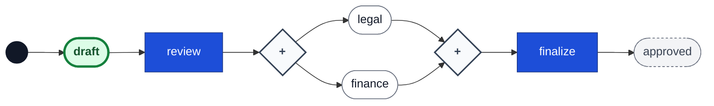

# Go Workflow

[](https://github.com/ehabterra/workflow/actions/workflows/ci.yml)
[](https://goreportcard.com/report/github.com/ehabterra/workflow)
[](https://go.dev/)
[](https://github.com/ehabterra/workflow/blob/main/LICENSE)
[](https://codecov.io/gh/ehabterra/workflow)

> **⚠️ A Note from the Developers:**  
> This workflow engine is currently in active development. We're building it to be reliable and easy to use, but it's **not quite ready for mission-critical production yet**. We're a growing open-source project, and we truly welcome any feedback, contributions, or real-world testing you can offer to help us make it great.  
>
> If you like the idea of building smart, durable workflows in Go, please join us!

## What is Go Workflow?

Go Workflow is a flexible engine for orchestrating steps, tasks, and data within your Go applications.

Our engine is rooted in **Petri Net theory**, which is just a fancy way of saying we use a rock-solid mathematical foundation to manage flow. When you model a complex process with many parallel paths, splits and joins are explicit, well-defined operations on a marking — not ad-hoc flags — and the model is in principle amenable to formal analysis. (Note: the library does not yet ship a static checker, so deadlock detection is on the roadmap, not a built-in guarantee.)

We're focused on **portability** and **visualization**, allowing you to change your complex processes easily without touching or recompiling your application code.

Inspired by [Symfony Workflow Component](https://symfony.com/doc/current/workflow.html).

## Key Features

### 💻 Keep Your Code Clean & Flexible (Portability)

* **YAML Processes:** Define your entire process structure and logic in simple YAML configuration files. This means your business teams can look at the flow, and your engineering team can deploy updates instantly.
* **Dynamic Decision Logic:** Use an expressive guard language (powered by [expr-lang/expr](https://github.com/expr-lang/expr)) to handle decisions like "If the amount is over $1000, send to manager approval". This logic lives in your config file, keeping it flexible and separate from your Go application code.
* **Context-Aware Storage:** We built a flexible layer to reliably save the flow's current state and all its necessary data (like an `order_id` or `user_role`) to a database, ensuring long-running processes are safe from crashes.

### ✅ Built for Reliability (Petri Net Power)

* **Mathematically Sound:** Our Petri Net core gives parallel paths and merging logic precise token semantics, which makes complex flows analyzable. A static validator/deadlock checker is planned but not yet shipped, so correctness of a given definition is still up to you today.
* **Thread-Safe Registry:** The workflow registry uses proper locking to safely handle concurrent access from multiple goroutines.
* **Audit Trail Ready:** Our pluggable history layer can record every transition, letting you track exactly who did what and when. Recording is opt-in: use the `yaml.ApplyTransitionByNameWithHistory` helper or call the history store from your own event hooks — transitions are not logged automatically.

### 📊 Easy to Understand (Visualization)

* **Mermaid Diagram Generation:** Quickly generate visual flowcharts from your definition. You can paste these diagrams into your documentation (like this README!) for instant visualization.
* **Workflow Manager:** A clean, straightforward interface for loading, starting, and saving all your running workflow instances.

### Technical Highlights

* Support for multiple states and parallel transitions
* Event system for workflow lifecycle hooks
* Constraint system for custom validation logic
* Comprehensive test coverage

## Storage Layer

We designed the storage interface to be flexible. You tell us where to put the data and what extra information you need to store.

### Storage Interface

The package provides a flexible, context-aware storage interface for persisting workflow markings and context data. Every method takes a `context.Context` so callers can apply cancellation and deadlines:

```go
type Storage interface {
    // LoadState loads the workflow's marking, context data, and current
    // optimistic-concurrency version in one atomic snapshot.
    LoadState(ctx context.Context, id string) (marking Marking, context map[string]any, version int64, err error)

    // SaveState saves the workflow only if the stored version equals
    // expectedVersion (0 creates), returning the new version. A stale writer
    // gets ErrConflict instead of silently overwriting a concurrent save.
    SaveState(ctx context.Context, id string, marking Marking, context map[string]any, expectedVersion int64) (int64, error)

    // DeleteState removes the workflow state for the given ID.
    DeleteState(ctx context.Context, id string) error
}
```

Optimistic concurrency is part of the contract, not an optional add-on: two writers racing to save the same workflow can never silently clobber each other. You can implement your own storage backend by implementing this interface. The package includes SQLite and PostgreSQL implementations with options for custom fields (both also expose `SaveStateTx`/`LoadStateTx` for transactional use):

```go
import (
    "github.com/ehabterra/workflow"
    "github.com/ehabterra/workflow/storage"
)

// Create a SQLite storage with custom fields
store, err := storage.NewSQLiteStorage(db,
    storage.WithTable("workflow_states"),
    storage.WithCustomFields(map[string]string{
        "title": "title TEXT",
        "owner": "owner TEXT",
    }),
)
if err != nil { panic(err) }

// Create (or idempotently migrate) the schema
if err := store.EnsureSchema(ctx); err != nil { panic(err) }

// Save the marking together with context data (expectedVersion 0 creates)
marking := workflow.NewMarking([]workflow.Place{"draft"})
_, err = store.SaveState(ctx, "my-workflow", marking, map[string]any{"title": "My Doc", "owner": "alice"}, 0)

// Load the marking, context data, and version
loaded, data, version, err := store.LoadState(ctx, "my-workflow")
fmt.Println(loaded.Places(), data["title"], data["owner"], version)
```

## History Layer

The history layer is a pluggable audit trail, letting you track and query every single state change that happens in your processes. It supports custom fields, pagination, and filtering.

### History Interface

```go
type HistoryStore interface {
    SaveTransition(ctx context.Context, record *TransitionRecord) error
    ListHistory(ctx context.Context, workflowID string, opts QueryOptions) ([]TransitionRecord, error)
    GenerateSchema() string
    Initialize(ctx context.Context) error
}
```

Note that history is **opt-in**: transitions are not recorded automatically. Call `SaveTransition` yourself (for example from an `EventAfterTransition` listener), or use the `yaml.ApplyTransitionByNameWithHistory` helper, which applies a transition and records it in one call.

### SQLite History Example

```go
import "github.com/ehabterra/workflow/history"

historyStore := history.NewSQLiteHistory(db,
    history.WithCustomFields(map[string]string{
        "ip_address": "ip_address TEXT",
    }),
)
if err := historyStore.Initialize(ctx); err != nil { panic(err) }

// Save a transition with custom fields
err = historyStore.SaveTransition(ctx, &history.TransitionRecord{
    WorkflowID: "wf1",
    FromState:  "draft",
    ToState:    "review",
    Transition: "submit",
    Notes:      "Submitted for review",
    Actor:      "alice",
    CreatedAt:  time.Now(),
    CustomFields: map[string]any{
        "ip_address": "127.0.0.1",
    },
})

// List history with pagination
records, err := historyStore.ListHistory(ctx, "wf1", history.QueryOptions{Limit: 10, Offset: 0})
for _, rec := range records {
    fmt.Println(rec.FromState, rec.ToState, rec.Notes, rec.CustomFields["ip_address"])
}
```

## Feature Checklist

### Current Features ✅

* [x] Basic workflow definition and execution
* [x] Multiple states and transitions
* [x] Event system for workflow hooks
* [x] Constraint system for transitions
* [x] Thread-safe workflow registry
* [x] Mermaid diagram visualization
* [x] Workflow manager for lifecycle management
* [x] Storage interface for persistence
* [x] SQLite storage implementation
* [x] PostgreSQL storage implementation
* [x] Optimistic concurrency built into the `Storage` contract, plus transactional building blocks (`RunInTx`, `SaveStateTx`/`LoadStateTx`)
* [x] Colored Petri Nets (CPN): multiple data-carrying tokens per place, per-token firing, and token-aware guards — see [docs/guides/CPN_GUIDE.md](docs/guides/CPN_GUIDE.md)
* [x] Host-driven timers: declare durations (`after: 72h`), the host owns the clock — timeouts and escalation with no internal scheduler — see [docs/guides/TIMERS_GUIDE.md](docs/guides/TIMERS_GUIDE.md)
* [x] Support for parallel transitions and branching
* [x] Workflow history and audit trail (in examples)
* [x] Web UI for workflow management (in examples)
* [x] YAML configuration support

> **Note:** The provided example includes a Web UI for workflow management, but does **not** expose a REST API. If you need a REST API, contributions or feature requests are welcome!

### Building Smarter Workflows: The Roadmap 🚀

We're starting with the basics of Petri Nets and adding layers of powerful features inspired by industry tools, focusing on solving common developer problems.

#### High Priority: Making it Durable and Multi-Tasking

| Feature Description | The Problem We're Solving | Petri Net Concept |
| :--- | :--- | :--- |
| **Smart Tokens (Colored Petri Nets - CPN)** — ✅ **shipped** | How do you process a batch of 100 orders within one workflow instance? | **Tokens carry data.** Tokens carry attributes (like an order ID), allowing one process to manage multiple concurrent items. See [docs/guides/CPN_GUIDE.md](docs/guides/CPN_GUIDE.md). |
| **Nested Workflows (HCPN)** | My process has 100 steps—it's too big to manage. | **Modularity.** You can define a complex sub-flow (like "Payment Verification") once and drop it into any main process as a single, clean step. |
| **Crash-Safe Storage (ACID)** — ✅ **shipped** | What if the server dies during a critical step? | **Data Integrity.** Optimistic concurrency built into the storage contract, transactional building blocks (`RunInTx`, `SaveStateTx`/`LoadStateTx`), and an atomic execute helper (`Manager.Execute` with `WithTxSideEffect`) commit a state change and its history record in one transaction. |
| **Undo Button (Compensation/Rollback)** | I need a way to reliably "undo" a previous action if a later step fails (e.g., refunding a charge). | **Error Recovery.** We'll track the history of completed tasks precisely, enabling safe, structured rollbacks. |
| **Advanced Synchronization** | When two parallel paths finish, how do I make the third step wait only for the *first* path, but cancel the second one? | **Complex Merging.** We're implementing advanced logic (like nested AND/OR/XOR conditions and discriminators) for robust handling of parallel flows. |

#### Medium Priority: Handling Time and External Events

| Feature Description | The Problem We're Solving | Petri Net Concept |
| :--- | :--- | :--- |
| **Timeouts and Scheduled Steps (TPN/DPN)** — ✅ **shipped** | I need a task to wait exactly 30 minutes before starting, or to timeout after 24 hours. | **Time Awareness.** Transitions declare durations (`after: 72h`); the host owns the clock (`ListDue` + `FireDue` cron), so there is no internal scheduler. See [docs/guides/TIMERS_GUIDE.md](docs/guides/TIMERS_GUIDE.md). |
| **Workflow Checker (Validation System)** | How do I know my new YAML definition won't cause a bug? | **Pre-Execution Guarantees.** We'll use Petri Net math to check the flow for common issues like deadlocks *before* you deploy it. |
| **Talk to Other Workflows (Message Correlation)** | I need Workflow A to wait for a signal from a completely separate Workflow B. | **Inter-Process Communication.** Building a reliable way for instances to communicate and find each other using shared data keys. |

#### Additional Planned Features

* [ ] Build standalone web interface for workflow management
* [ ] Enhance REST API endpoints
* [ ] Add process variable scope management - local vs global variable scoping hierarchy
* [ ] Add workflow versioning support
* [ ] Create workflow templates system
* [ ] Implement role-based access control
* [ ] Add weighted transitions - token counting requirements for transition firing
* [ ] Workflow statistics and analytics
* [ ] Export/Import workflow definitions - complete YAML round-trip (export Go definitions back to YAML) and/or PNML (Petri Net Markup Language) support for interoperability with other Petri net tools

-----

## Understanding the Technical Foundation

This workflow engine is built on Petri net foundations and incorporates concepts inspired by BPMN to make it suitable for business process automation. The goal is not full BPMN compliance, but rather to enhance Petri nets with practical, business-reliable features.

Below are some of the advanced concepts we're working on. Don't worry if these seem complex—the basic workflow functionality is straightforward and well-documented above.

### Colored Petri Nets (CPN)

**What is a Token?** In Petri nets, a token is a marker that sits in a place (state). A place can have 0, 1, or multiple tokens. The engine's unified marking supports both the simple boolean style (a place is either marked or not) and full colored tokens (multiple data-carrying tokens per place).

**What is CPN?** Colored Petri Nets allow tokens to carry data attributes (called "color"). This enables:

* **Per-token data**: Each token in a place can have different attributes (e.g., order ID, customer name, amount)
* **Multiple tokens per place**: One workflow instance can have multiple tokens in the same place, each with different data
* **Data-driven decisions**: Transitions can evaluate token attributes to route tokens differently
* **Resource tracking**: Tokens can carry resource assignments (e.g., which employee is handling this task)

**Current Implementation (CPN is shipped):**

* ✅ **Multiple workflow instances**: You CAN have `workflow-1`, `workflow-2`, `workflow-3`, each in "pending" with different contexts
* ✅ **Multiple tokens per place**: One workflow instance CAN hold multiple data-carrying tokens in the same place; transitions fire per token, and guards can inspect token attributes
* ✅ **Token queries**: `Marking` exposes `TokensAt`, `TokenCount`, `AllTokens`, `HasToken` alongside the simple place set
* See [docs/guides/CPN_GUIDE.md](docs/guides/CPN_GUIDE.md) and the runnable [examples/cpn_batch_processing](examples/cpn_batch_processing) / [examples/cpn_routing](examples/cpn_routing) examples

**CPN Example (within ONE workflow instance):**

```text
Workflow: "order-batch-1"
Place: "pending_review"
  ├─ Token 1: {order_id: "001", amount: 100, customer: "Alice"}
  ├─ Token 2: {order_id: "002", amount: 500, customer: "Bob"}  
  └─ Token 3: {order_id: "003", amount: 50, customer: "Charlie"}

Transition "route_by_amount" evaluates each token:
  - Token 1 (amount: 100) → "auto_approve"
  - Token 2 (amount: 500) → "manager_approval"  
  - Token 3 (amount: 50) → "auto_approve"
```

**Advantages of Multiple Tokens per Workflow:**

1. **Batch Processing & Atomic Operations**: Process multiple items as a single unit. Example: "All 10 orders in this batch must be approved before shipping" - if one fails, the entire batch can be rolled back.

2. **Shared Workflow Context**: All tokens share workflow-level data (e.g., batch ID, shipping date, warehouse location). Changes to workflow context affect all tokens simultaneously.

3. **Coordination & Synchronization**: Tokens can wait for each other. Example: "Wait until all 3 documents are reviewed before proceeding" - enables complex synchronization patterns.

4. **Resource Efficiency**: One workflow instance instead of N instances reduces overhead, storage, and management complexity. Single workflow ID to track instead of managing hundreds.

5. **Workflow-Level Constraints**: Enforce rules across all tokens. Example: "Total batch value must not exceed $10,000" - can evaluate sum of all token amounts before allowing transition.

6. **Simplified State Management**: One workflow state instead of tracking N separate states. Easier to query "show me all batches in review" vs "show me all individual orders in review".

7. **Parallel Processing with Shared State**: Tokens can process in parallel while sharing workflow-level resources (e.g., shared approval queue, shared budget pool).

**Example Use Cases:**

* **Document Batch Processing**: Process 100 invoices together, all must be validated before payment batch is created
* **Order Fulfillment**: Ship multiple items together - all must be ready before shipping
* **Approval Workflows**: Multiple documents need approval, but workflow-level rules apply (e.g., "if any document is rejected, reject entire batch")
* **Assembly Lines**: Multiple parts (tokens) flow through assembly, but assembly-level constraints apply (e.g., "all parts must be quality-checked before assembly")

**Relation to Weighted Transitions:** Weighted transitions require multiple tokens to fire (e.g., "need 3 tokens in approval place"). CPN adds data to those tokens, so you can track WHICH 3 approvals you have (e.g., manager, director, finance).

### Hierarchical Colored Petri Nets (HCPN)

**What is HCPN?** Hierarchical Colored Petri Nets allow workflows to contain other workflows as sub-processes, creating different levels of abstraction and refinement. This enables:

* **Sub-processes**: A place or transition can expand into a complete nested workflow
* **Modular design**: Break complex workflows into reusable, manageable components
* **Abstraction levels**: View workflow at high level (summary) or drill down into details (sub-process)
* **Reusable fragments**: Define common process patterns once and reuse across multiple workflows

**BPMN-Inspired Concept**: This concept is inspired by BPMN sub-processes, embedded sub-processes, and reusable process fragments. Essential for managing large enterprise workflows where complexity requires decomposition.

**Example Use Case:**

```text
Main Workflow: "Order Processing"
  ├─ Place: "payment_processing" 
  │   └─ Expands to Sub-Workflow: "Payment Workflow"
  │       ├─ Validate card
  │       ├─ Charge payment
  │       └─ Send receipt
  ├─ Place: "inventory_check"
  │   └─ Expands to Sub-Workflow: "Inventory Workflow"
  │       ├─ Check stock
  │       ├─ Reserve items
  │       └─ Update availability
  └─ Place: "shipping"
      └─ Expands to Sub-Workflow: "Shipping Workflow"
```

**Benefits:**

* **Complexity Management**: Break 100+ step workflows into logical modules
* **Reusability**: Define "approval workflow" once, use in multiple parent workflows
* **Maintainability**: Update sub-process in one place, affects all parent workflows
* **Team Collaboration**: Different teams can work on different sub-processes independently
* **Testing**: Test sub-processes in isolation before integrating into parent workflow

### Timed Petri Nets (TPN/DPN)

**Time Petri Nets (TPN)**: Use time intervals for transitions (e.g., "between 10-30 minutes"). Transitions can fire within a time window.

**Duration Petri Nets (DPN)**: Use deterministic time values for transitions (e.g., "exactly 30 minutes"). Transitions require a fixed duration before completion.

**BPMN-Inspired Concept**: Inspired by BPMN Timer Events, which introduce delays or scheduled execution. **Shipped as host-driven timers**: a transition declares a duration (`after: 72h` in YAML, or `SetTimeoutAfter`), tokens record when they entered a place, and `Workflow.Due(now)` is a pure function of the marking and the host's clock. There is no internal scheduler — a host cron scans the fleet with `Manager.ListDue` and advances due instances with `Manager.FireDue`, which makes it restart-safe by construction (state in the database, clock in the host). See [docs/guides/TIMERS_GUIDE.md](docs/guides/TIMERS_GUIDE.md).

### Business Process Reliability Features

The following features are inspired by BPMN and designed to make the engine production-ready for enterprise use:

* **Transactional Persistence**: Ensures state changes are atomic (all or nothing) and durable, so your processes survive crashes and restarts
* **Message Correlation**: Allows different workflow instances to communicate with each other and wait for external signals
* **Compensation/Rollback**: Tracks what happened so you can safely undo previous steps if something goes wrong
* **Variable Scope Management**: Proper data isolation between tasks (local variables) and shared workflow data (global variables)

-----

## Installation

```bash
go get github.com/ehabterra/workflow
```

## YAML Configuration (New!)

You can define your entire process in a simple YAML file with expression-based guards, metadata, and storage configuration. See the [YAML documentation](yaml/README.md) for complete details.

**Quick Example:**

```yaml
workflow:
  name: blog_publishing
  initial_marking: draft
  transitions:
    - name: to_review
      from: [draft]
      to: [reviewed]
      guard: "workflow.Context('word_count') <= 500 and hasRole('author')"
      notes: "Submitted for review"
      actor: "author"
```

```go
import "github.com/ehabterra/workflow/yaml"

config, _ := yaml.LoadConfig("workflow.yaml")
loader := yaml.NewLoader()
wf, _ := loader.LoadWorkflow(config, "blog-post-1")
```

## Expression-Based Guards

The workflow engine supports powerful expression-based guards using the [expr-lang/expr](https://github.com/expr-lang/expr) expression language. This lets you write conditions like "only allow this transition if the user is a manager and the amount is over $1000" directly in your YAML configuration. Expressions are evaluated at runtime to determine if a transition is allowed.

### Basic Usage

Expressions are defined in YAML configuration or programmatically:

```yaml
transitions:
  - name: publish
    from: [reviewed]
    to: [published]
    guard: "hasRole('editor') or hasRole('admin')"
```

```go
import "github.com/ehabterra/workflow"

// Programmatic usage
constraint, _ := workflow.NewExpressionConstraint(
    "workflow.Context('amount') > 1000 and hasRole('manager')",
)
transition.AddConstraint(constraint)
```

### Available Variables

Expressions have access to the following variables:

* **`workflow`** - The workflow instance (access context, places, etc.)
* **`transition`** - The transition name (string)
* **`from`** - Source places ([]Place)
* **`to`** - Target places ([]Place)
* **All workflow context values** - Accessible directly by key

### Helper Functions

The expression environment includes several built-in helper functions:

#### `hasRole(role string) bool`

Checks if the workflow has a specific role. Roles are stored in workflow context as `roles` (can be string, []string, or []interface{}).

```yaml
guard: "hasRole('admin')"
guard: "hasRole('editor') or hasRole('manager')"
```

```go
wf.SetContext("roles", []string{"author", "editor"})
```

#### `hasPermission(permission string) bool`

Checks if the workflow has a specific permission. Permissions are stored in workflow context as `permissions`.

```yaml
guard: "hasPermission('publish')"
```

#### `in(value, list) bool`

Checks if a value exists in a list.

```yaml
guard: "workflow.Context('status') in ['active', 'pending']"
```

### Expression Examples

**Simple role check:**

```yaml
guard: "hasRole('admin')"
```

**Multiple conditions:**

```yaml
guard: "workflow.Context('amount') > 1000 and hasRole('manager')"
```

**Complex logic:**

```yaml
guard: "hasRole('editor') or (hasRole('author') and workflow.Context('word_count') <= 500)"
```

**Using context values:**

```yaml
guard: "workflow.Context('status') == 'active' and workflow.Context('priority') > 5"
```

**Combining conditions:**

```yaml
guard: "(hasRole('admin') or hasRole('editor')) and workflow.Context('approved') == true"
```

**List operations:**

```yaml
guard: "workflow.Context('tags') contains 'urgent'"
guard: "workflow.Context('category') in ['tech', 'news', 'opinion']"
```

### Custom Environment Builder

You can provide a custom environment builder to add your own variables and functions:

```go
import "github.com/ehabterra/workflow/yaml"

loader := yaml.NewLoaderWithEnv(func(event workflow.Event) map[string]interface{} {
    env := make(map[string]interface{})
    
    // Add custom variables
    env["user"] = getUserFromContext(event)
    env["request"] = getRequestFromContext(event)
    env["currentTime"] = time.Now()
    
    // Add custom functions
    env["isBusinessHours"] = func() bool {
        now := time.Now()
        return now.Hour() >= 9 && now.Hour() < 17
    }
    
    env["isWeekend"] = func() bool {
        weekday := time.Now().Weekday()
        return weekday == time.Saturday || weekday == time.Sunday
    }
    
    env["hasAccess"] = func(resource string) bool {
        // Your custom access control logic
        return checkAccess(event, resource)
    }
    
    return env
})

// Now you can use these in expressions:
// guard: "isBusinessHours() and hasAccess('publish')"
// guard: "user.Department == 'Engineering' and not isWeekend()"
```

### Expression Constraints

Expressions can also be used programmatically as constraints:

```go
import "github.com/ehabterra/workflow"

// Create expression constraint
constraint, err := workflow.NewExpressionConstraint(
    "workflow.Context('balance') >= workflow.Context('amount')",
)
if err != nil {
    // Handle compilation error
}

// Add to transition
transition.AddConstraint(constraint)

// Or with custom environment
constraint, err := workflow.NewExpressionConstraintWithEnv(
    "customFunction(workflow.Context('data'))",
    customEnvBuilder,
)
```

### Expression Safety

The expr library provides several safety guarantees:

* ✅ **Memory-Safe**: No memory vulnerabilities
* ✅ **Side-Effect-Free**: Expressions only compute outputs from inputs
* ✅ **Always Terminating**: Prevents infinite loops
* ✅ **Type-Safe**: Static type checking at compile time

### Error Handling

If an expression fails to compile or evaluate, the transition will be blocked:

```go
constraint, err := workflow.NewExpressionConstraint("invalid syntax")
if err != nil {
    // Expression compilation failed
    log.Printf("Expression error: %v", err)
}

// At runtime, if evaluation fails, the transition is blocked
err = wf.Apply([]workflow.Place{"published"})
if err != nil {
    // Transition blocked - check if it was due to expression
}
```

-----

## Quick Start

Here's a simple example showing how to create a workflow, persist it to storage, and apply transitions. This example demonstrates the context-aware storage and options pattern:

```go
package main

import (
    "context"
    "database/sql"
    "fmt"

    "github.com/ehabterra/workflow"
    "github.com/ehabterra/workflow/storage"
    _ "github.com/mattn/go-sqlite3"
)

func main() {
    ctx := context.Background()

    // Open SQLite DB (in-memory for demo)
    db, err := sql.Open("sqlite3", ":memory:")
    if err != nil { panic(err) }

    // Create storage with custom fields
    store, err := storage.NewSQLiteStorage(db,
        storage.WithTable("workflow_states"),
        storage.WithCustomFields(map[string]string{
            "title": "title TEXT",
        }),
    )
    if err != nil { panic(err) }
    if err := store.EnsureSchema(ctx); err != nil { panic(err) }

    // Define workflow
    definition, err := workflow.NewDefinition(
        []workflow.Place{"start", "middle", "end"},
        []workflow.Transition{
            *workflow.MustNewTransition("to-middle", []workflow.Place{"start"}, []workflow.Place{"middle"}),
            *workflow.MustNewTransition("to-end", []workflow.Place{"middle"}, []workflow.Place{"end"}),
        },
    )
    if err != nil { panic(err) }

    // Create manager
    registry := workflow.NewRegistry()
    manager := workflow.NewManager(registry, store)

    // Create a new workflow with context data
    wf, err := manager.CreateWorkflow(ctx, "my-workflow", definition, "start")
    if err != nil { panic(err) }
    wf.SetContext("title", "My Example Workflow")
    if err := manager.SaveWorkflow(ctx, "my-workflow", wf); err != nil { panic(err) }

    // Apply a transition
    err = wf.Apply([]workflow.Place{"middle"})
    if err != nil { panic(err) }
    if err := manager.SaveWorkflow(ctx, "my-workflow", wf); err != nil { panic(err) }

    // Load marking and context data from storage
    marking, data, _, err := store.LoadState(ctx, "my-workflow")
    if err != nil { panic(err) }
    fmt.Printf("Current places: %v, Title: %v\n", marking.Places(), data["title"])

    // Generate and print the workflow diagram
    diagram := wf.Diagram()
    fmt.Println(diagram)
}
```

-----

## Advanced Usage

### Using the Workflow Manager

The workflow manager provides a straightforward interface for creating, loading, and saving workflows. It loads fresh from storage by default (correct in every deployment shape) and can optionally cache instances in the registry for single-process setups:

```go
ctx := context.Background()

// Create a registry and a storage backend
db, err := sql.Open("sqlite3", "workflows.db")
if err != nil {
    panic(err)
}
store, err := storage.NewSQLiteStorage(db)
if err != nil {
    panic(err)
}
if err := store.EnsureSchema(ctx); err != nil {
    panic(err)
}
registry := workflow.NewRegistry()

// Create a workflow manager. Every load reads fresh from storage; add
// workflow.WithRegistryCache() to serve repeat loads from the in-process
// registry (single-process deployments only).
manager := workflow.NewManager(registry, store)

// Create a new workflow
wf, err := manager.CreateWorkflow(ctx, "my-workflow", definition, "start")
if err != nil {
    panic(err)
}

// Get a workflow (loads from storage if not in registry)
wf, err = manager.GetWorkflow(ctx, "my-workflow", definition)
if err != nil {
    panic(err)
}

// Save workflow state
err = manager.SaveWorkflow(ctx, "my-workflow", wf)
if err != nil {
    panic(err)
}

// Delete a workflow
err = manager.DeleteWorkflow(ctx, "my-workflow")
if err != nil {
    panic(err)
}
```

### Adding Constraints

You can add constraints to transitions to control when they can be applied:

```go
type MyConstraint struct{}

func (c *MyConstraint) Validate(event workflow.Event) error {
    // Add your validation logic here
    return nil
}

// Add the constraint to a transition
tr.AddConstraint(&MyConstraint{})
```

### Using the Registry

The registry allows you to manage multiple workflows and is **thread-safe** for concurrent access:

```go
registry := workflow.NewRegistry()

// Add a workflow
err := registry.AddWorkflow(wf)

// Get a workflow
wf, err := registry.Workflow("my-workflow")

// List all workflows
names := registry.ListWorkflows()

// Check if workflow exists
exists := registry.HasWorkflow("my-workflow")

// Remove a workflow
err = registry.RemoveWorkflow("my-workflow")
```

**Thread Safety**: The Registry is designed for concurrent access:

* ✅ **Read operations** (`Workflow`, `ListWorkflows`, `HasWorkflow`) use read locks for optimal performance
* ✅ **Write operations** (`AddWorkflow`, `RemoveWorkflow`) use write locks for data consistency
* ✅ **Concurrent reads and writes** are properly synchronized
* ✅ **Race condition free** - all operations are atomic

Example of concurrent usage:

```go
registry := workflow.NewRegistry()

// Multiple goroutines can safely access the registry
go func() {
    for i := 0; i < 100; i++ {
        wf := createWorkflow(fmt.Sprintf("workflow-%d", i))
        registry.AddWorkflow(wf)
    }
}()

go func() {
    for i := 0; i < 100; i++ {
        name := fmt.Sprintf("workflow-%d", i)
        wf, err := registry.Workflow(name)
        if err == nil {
            // Process workflow
        }
    }
}()

go func() {
    for i := 0; i < 100; i++ {
        names := registry.ListWorkflows()
        // Process workflow list
    }
}()
```

### Event Types

The workflow engine supports several event types:

* `EventBeforeTransition`: Fired before a transition is applied
* `EventAfterTransition`: Fired after a transition is applied
* `EventGuard`: Fired to check if a transition is allowed

### Context

You can attach context data to workflows:

```go
wf.SetContext("key", "value")
value, ok := wf.Context("key")
```

### Workflow Visualization

The package includes a Mermaid diagram generator for visualizing workflows. The generated diagrams can be rendered in any Mermaid-compatible viewer (like GitHub, GitLab, or the Mermaid Live Editor).

```go
// Generate a Mermaid diagram
diagram := wf.Diagram()
fmt.Println(diagram)
```

Example output — splits and merges route through gateway diamonds with the
BPMN symbols: the AND-split forks through `◇+` (parallel gateway), the
AND-join joins through `◇+` (`◇×`, the exclusive gateway, for OR-input
transitions); guards appear on the routing edges and the live marking is
highlighted:



## Benchmarks

The package includes benchmarks for common operations. Run them with:

```bash
go test -bench=. ./...
```

## Contributing

We're building this engine in the open and would love your help! If you're interested in database durability, expressive language parsing, or Petri Net theory, please take a look at our issues or submit a Pull Request. Every contribution, big or small, helps make this project better.

## License

This project is licensed under the MIT License - see the LICENSE file for details.
