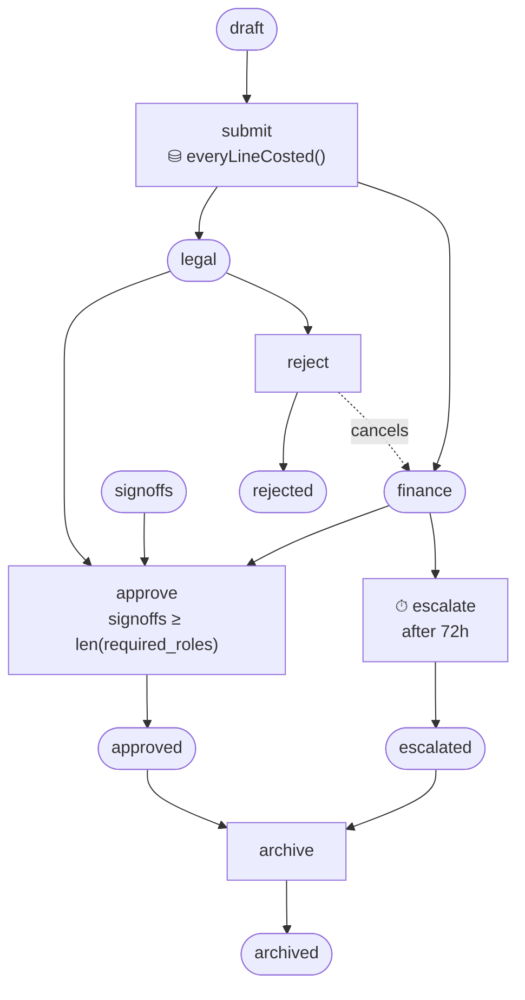

# Feature tour — the example that must stay current

A single runnable workflow exercising **every feature the library ships**, with
one test per feature. The other examples each illustrate one idea; this one is
the index.

```bash
go test ./examples/feature_tour/
```

## Why it exists

Three things rot independently: the code, the docs, and the belief that a
feature still works together with the others. This example is the place where
all three are checked at once. It is deliberately **inside the root module** —
no `go.mod` of its own — so `go test -p 1 ./...` compiles and runs it against the
working tree. An example pinned to a published version cannot demonstrate an
unreleased feature, and an example that never runs cannot fail.

It has already earned its keep: converting it surfaced a design defect in `#35`
(a transaction-scoped environment that replaced the standard one instead of
adding to it, so `actor` silently evaluated to nil) that neither the unit tests
nor review had caught.

## ▶ Adding a feature? Do these four things

1. **Use it in `workflow.yaml`** if it is declarable, with a `# [feature name]`
   comment saying what it demonstrates.
2. **Add one test to `tour_test.go`**, named for the feature, asserting the
   behavior a user would care about — not the implementation.
3. **Add a row to the table below**, linking the issue.
4. **Wire it in `tour.go`** if it needs host code (an effect implementation, an
   environment function, a storage capability).

If a feature genuinely cannot be shown here, say why in the table rather than
leaving the row out. A gap that is written down is a decision; a gap that is
missing is a bug waiting.

## What is demonstrated

| Feature | Where | Test |
|---|---|---|
| Marking as state (parallel places) | `submit` AND-split | `TestMarkingIsTheState` |
| Place metadata → status projection | `places:` metadata | `TestMarkingIsTheState` |
| Guards (expression over context) | `reject` | `TestGuardRejectsWithoutTheRole` |
| **Transaction-scoped guards** ([#35](https://github.com/ehabterra/workflow/issues/35)) | `submit`, `approve` | `TestTxGuardReadsHostStateInTheFiringTransaction`, `TestSeparationOfDutiesIsReadLive` |
| **Dynamic-cardinality join** ([#34](https://github.com/ehabterra/workflow/issues/34)) | `approve` `require:` | `TestDynamicCardinalityJoin` |
| Colored tokens (data-carrying) | the `signoffs` pool | `TestDynamicCardinalityJoin` |
| AND-join | `approve` | `TestDynamicCardinalityJoin` |
| OR-input / `from_any` | `archive` | `TestOrInputConsumesOnlyTheMarkedStage` |
| Reset arcs (cancellation regions) | `reject`, `approve` | `TestResetArcsCancelSiblingBranches` |
| Host-driven timers (`after:`) | `escalate` | `TestHostDrivenTimers` |
| **Declared effects** ([#36](https://github.com/ehabterra/workflow/issues/36)) | `effects:` on every transition | `TestEffectsCommitWithTheStateChange` |
| **After-commit phase** ([#36](https://github.com/ehabterra/workflow/issues/36)) | `after_commit:` | `TestEffectsCommitWithTheStateChange` |
| Atomic effects (roll back with state) | — | `TestEffectFailureRollsBackTheStateChange` |
| Effect-registry startup validation | `New` | covered by every test (it runs at wiring) |
| Definition fingerprint | — | `TestDefinitionFingerprintCatchesADriftedDefinition` |
| Mermaid diagrams from the definition | — | `TestDiagramIsGeneratedFromTheDefinition` |
| Strict YAML decoding | `New` | covered by every test |
| Optimistic concurrency (`Execute` retries) | `Fire` | exercised throughout; contention is covered in the root suite |

### Not demonstrated here, and why

| Feature | Why not |
|---|---|
| Postgres backend | The tour runs on SQLite so it needs no Docker. Both backends are held to the same contract by `storagetest`. |
| Per-token firing (`ApplyTransitionForToken`) | It is mutually exclusive with `require:`, which this net uses. See `examples/cpn_batch_processing`. |
| Cross-instance token queries (`ListPlaceTokens`) | Needs a fleet; the tour is one instance at a time. |
| History store | Opt-in and separate from the core; see the `history/` package. |
| OpenTelemetry (`contrib/otel`) | Separate module, so it cannot be imported from the root one. |
| Definition migration | Needs two deployed versions of a definition; `TestDefinitionFingerprintCatchesADriftedDefinition` covers the detection half. |
| Atomic multi-instance transitions | Not shipped — [#37](https://github.com/ehabterra/workflow/issues/37). |
| Declarative status projection | Not shipped — [#39](https://github.com/ehabterra/workflow/issues/39). `Status()` is host code here, which is the point. |
| Identifiable guard rejections | Not shipped — [#38](https://github.com/ehabterra/workflow/issues/38). |

## The workflow

A document review: submit splits into legal **and** finance review, sign-offs
accumulate in a pool until the required set is complete, finance escalates on a
deadline, and either outcome can be archived.



The library renders the real one, with the live marking highlighted:
`tour.Diagram(ctx, id)`.
